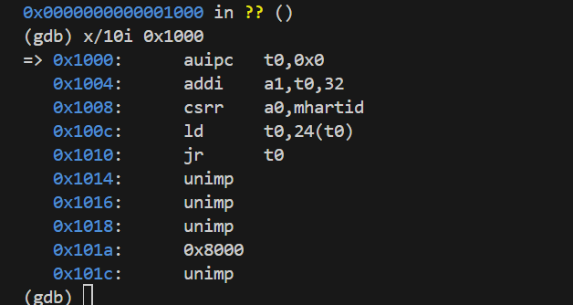
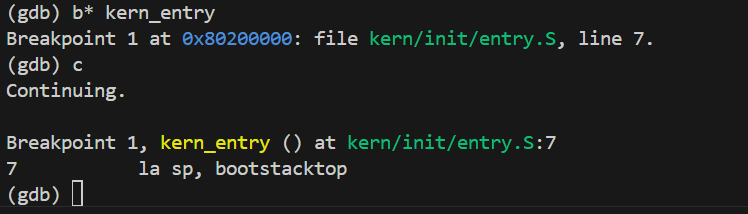
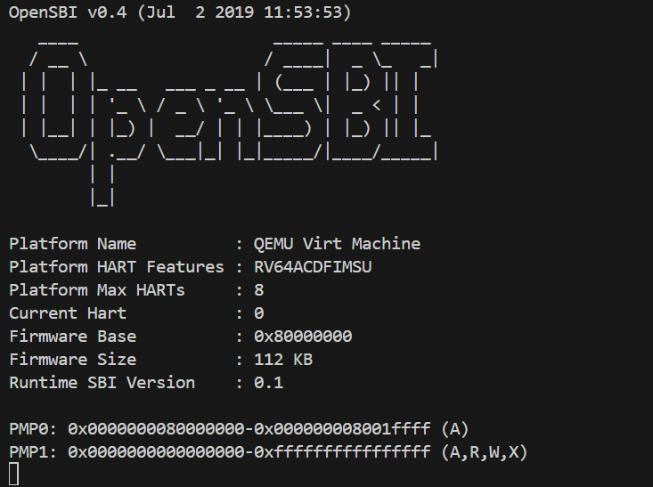
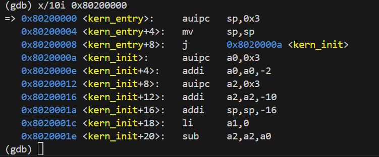
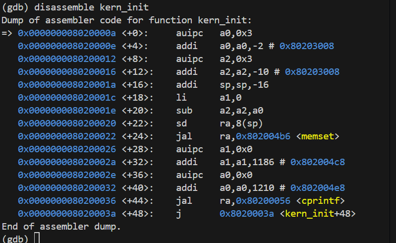
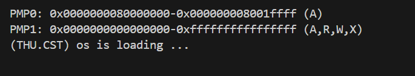

## 1 小组成员及学号

### 组长：龚子超-2312005
### 组员：熊泽宇-2312015，吴红祥-2312558

## 2 填写各个基本练习中要求完成的报告内容

### 2.1 练习一
阅读 kern/init/entry.S内容代码，结合操作系统内核启动流程，说明指令 la sp, bootstacktop 完成了什么操作，目的是什么？ tail kern_init 完成了什么操作，目的是什么？

la sp, bootstacktop
完成的操作：
la是RISC‑V汇编的伪指令，用来把符号 bootstacktop 的地址加载到栈指针寄存器sp中。
.data 段里定义了 bootstack 并使用 .space KSTACKSIZE 分配了内核引导用的栈空间，bootstacktop 则标记该栈区域的顶部地址。
目的：
进入 C 语言的内核初始化函数前先初始化栈指针。通过把 sp 指向栈顶 bootstacktop 为后续内核代码提供一个有效的内核栈。
在RISC‑V中栈向低地址增长，因此把 sp 设为 bootstacktop 意味着从高地址向低地址使用分配的栈空间。

tail kern_init
完成的操作：
tail 是一个用于实现跳转的汇编伪指令，等价于：

auipc t0, 0

jalr x0, kern_init

跳转到 kern_init，且不保存返回地址。
目的：
直接把控制权交给 kern_init，并且不会在 kern_entry 返回。
这样做可以避免创建多余的栈帧或保存返回地址，简化启动路径并减少开销；也保证启动完成后内核继续运行在 kern_init 控制下，而不是回到这个汇编入口。

### 2.2 练习二
为了熟悉使用 QEMU 和 GDB 的调试方法，请使用 GDB 跟踪 QEMU 模拟的 RISC-V 从加电开始，直到执行内核第一条指令（跳转到 0x80200000）的整个过程。通过调试，请思考并回答：RISC-V 硬件加电后最初执行的几条指令位于什么地址？它们主要完成了哪些功能？请在报告中简要记录你的调试过程、观察结果和问题的答案。
#### 2.2.1 阶段一：硬件初始化
在vs code中运行两个终端，分别运行make debug 与 make gdb。
RISC-V 硬件加电后最初执行的几条指令位置如下：

- 0x1000: auipc t0, 0x0

作用：auipc 是 RISC-V 的指令之一，表示 "Add Upper Immediate to PC"（将上半部分的立即数加到程序计数器中）。

它将立即数 0x0 加到程序计数器（PC）上，然后将结果存储到寄存器 t0 中。由于立即数为 0x0，这条指令仅仅将 PC 的当前值复制到 t0 （0x1000）中。

- 0x1004: addi a1, t0, 32

作用：addi 是 "Add Immediate" 指令，它将寄存器 t0 的值加上立即数 32，然后将结果存储到寄存器 a1 中。

这条指令计算 t0 + 32，并将结果存储在 a1(0x1020) 中。目的是准备数据进行下一步操作。

- 0x1008: csrr a0, mhartid

作用：csrr 是控制和状态寄存器（CSR）访问指令。这里访问 mhartid CSR，并将其值存储到寄存器 a0 中。

mhartid 是 "Machine Hart ID" 的缩写，表示机器级硬件线程的 ID。通过这条指令，获取当前硬件线程的 ID 并将其存储到 a0 寄存器中。

- 0x100c: ld t0, 24(t0)

作用：ld 是 "Load" 指令，它从内存地址 t0 + 24 中加载一个双字（64 位数据），并将结果存储到寄存器 t0 中。

这条指令是从内存中加载数据，地址是通过将 t0 的值加上 24 来计算的,最终t0为0x80000000。

- 0x1010: jr t0

作用：jr 是 "Jump Register" 指令，指令跳转到寄存器 t0 中存储的地址。

这意味着程序将跳转到 t0 中存储的地址并继续执行。

最终，执行5个si(逐步执行)，完成阶段一的实验。
#### 2.2.2 阶段二：SBI 固件进行主初始化
由指导书可知，其核心任务之一是将内核加载到 0x80200000,而且链接脚本(kern_entry)它指定了内核的入口地址。所以我们可以直接对kern_entry函数下断点：

在这行代码中，执行了一个 la 指令，用于将栈指针寄存器 sp 设置为 bootstacktop 的值。同时显示显示OpenSBI已经成功启动：

#### 2.2.3 阶段三：内核启动
输入指令：x/10i 0x80200000

在0x80200008地址处，程序跳转到了kern_init，因此，执行b* kern_init并继续continue，输入disassemble kern_init查看kern_init函数的反汇编代码：

显然可知，ern_init函数最后总是会跳到自己的地址，所以最终会进入到死循环中。继续运行下去，会发现OpenSBI结果如下：

## 3 列出你认为本实验中重要的知识点，以及与对应的OS原理中的知识点，并简要说明你对二者的含义，关系，差异等方面的理解（也可能出现实验中的知识点没有对应的原理知识点）
### 3.1 知识点
内核入口和启动流程
栈的建立和 sp 初始化
汇编和 C 语言衔接
### 3.2 含义
实验中实现的是最小可行启动流程，只建立栈并跳转；原理中还涉及更复杂的硬件初始化、页表设置与中断机制。
实验是单栈模型，用于内核初始化；原理中有多栈、多上下文管理，栈切换是进程/线程切换的重要部分。
实验直接跳转；实际内核中还会初始化堆、全局变量、BSS 段等运行时环境。
## 4 列出你认为OS原理中很重要，但在实验中没有对应上的知识点
进程调度算法： 实验1中尚未实现多进程，没有调度机制。
虚拟内存管理： 当前使用物理内存直接访问，没有页表机制。
内存分配器： 只有最基本的内存管理，没有动态分配机制。
系统调用接口： 尚未为用户程序提供系统调用服务。
