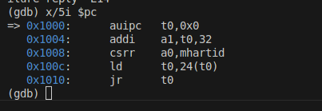
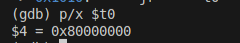
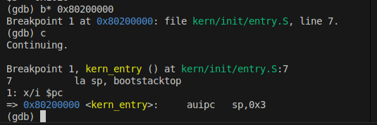
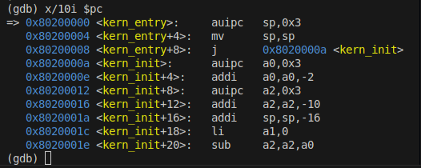

## 1 小组成员及学号

### 组长：龚子超-2312005
### 组员：熊泽宇-2312015，吴红祥-2312558

## 2 填写各个基本练习中要求完成的报告内容

### 2.1 练习一
阅读 kern/init/entry.S内容代码，结合操作系统内核启动流程，说明指令 la sp, bootstacktop 完成了什么操作，目的是什么？ tail kern_init 完成了什么操作，目的是什么？

la sp, bootstacktop
完成的操作：
la是RISC‑V汇编的伪指令，用来把符号 bootstacktop 的地址加载到栈指针寄存器sp中。
.data 段里定义了 bootstack 并使用 .space KSTACKSIZE 分配了内核引导用的栈空间，bootstacktop 则标记该栈区域的顶部地址。
目的：
进入 C 语言的内核初始化函数前先初始化栈指针。通过把 sp 指向栈顶 bootstacktop 为后续内核代码提供一个有效的内核栈。
在RISC‑V中栈向低地址增长，因此把 sp 设为 bootstacktop 意味着从高地址向低地址使用分配的栈空间。

tail kern_init
完成的操作：
tail 是一个用于实现跳转的汇编伪指令，等价于：

auipc t0, 0

jalr x0, kern_init

跳转到 kern_init，且不保存返回地址。
目的：
直接把控制权交给 kern_init，并且不会在 kern_entry 返回。
这样做可以避免创建多余的栈帧或保存返回地址，简化启动路径并减少开销；也保证启动完成后内核继续运行在 kern_init 控制下，而不是回到这个汇编入口。

### 2.2 练习二
为了熟悉使用 QEMU 和 GDB 的调试方法，请使用 GDB 跟踪 QEMU 模拟的 RISC-V 从加电开始，直到执行内核第一条指令（跳转到 0x80200000）的整个过程。通过调试，请思考并回答：RISC-V 硬件加电后最初执行的几条指令位于什么地址？它们主要完成了哪些功能？请在报告中简要记录你的调试过程、观察结果和问题的答案。
#### 2.2.1 阶段一：硬件初始化
在vs code中运行两个终端，分别运行make debug 与 make gdb。
RISC-V 硬件加电后最初执行的几条指令位置如下：

- 0x1000: auipc t0, 0x0
作用：auipc是RISC-V的指令之一，表示"Add Upper Immediate to PC"（将上半部分的立即数加到程序计数器中）。
它将立即数0x0加到程序计数器（PC）上，然后将结果存储到寄存器t0中。由于立即数为0x0，这条指令仅仅将PC的当前值0x1000复制到t0中。

- 0x1004: addi a1, t0, 32
作用：addi是"Add Immediate"指令，它将寄存器t0的值加上立即数32，然后将结果0x1020存储到寄存器a1中。
目的是准备数据进行下一步操作。

- 0x1008: csrr a0, mhartid
作用：csrr是控制和状态寄存器（CSR）访问指令。这里访问mhartid CSR，并将其值存储到寄存器a0中。
mhartid是"Machine Hart ID"的缩写，表示机器级硬件线程的ID。通过这条指令，获取当前硬件线程的ID并将其存储到a0寄存器中。

- 0x100c: ld t0, 24(t0)
作用：ld是"Load"指令，它从内存地址t0+24中加载一个双字（64bit），并将结果存储到寄存器t0中。
这条指令是从内存中加载数据，地址是通过将t0的值加上24来计算的,最终t0为0x80000000。

- 0x1010: jr t0
作用：jr是"Jump Register"指令，指令跳转到寄存器t0中存储的地址。
这意味着程序将跳转到t0中存储的地址并继续执行。

最终，执行5个si(逐步执行)，完成阶段一的实验。
#### 2.2.2 阶段二：SBI 固件进行主初始化
由指导书可知，其核心任务之一是将内核加载到0x80200000,所以我们可以直接对0x80200000下断点：

在代码中，执行了一个la指令，用于将栈指针寄存器sp设置为bootstacktop的值。同时显示OpenSBI已经成功启动：

#### 2.2.3 阶段三：内核启动
输入指令：x/10i $pc

在0x80200008地址处，程序跳转到了kern_init，因此，执行b* kern_init并继续continue，输入disassemble kern_init查看kern_init函数的反汇编代码：

显然可知，ern_init函数最后总是会跳到自己的地址，所以最终会进入到死循环中。继续运行下去，会发现OpenSBI结果如下：

## 3 列出你认为本实验中重要的知识点，以及与对应的OS原理中的知识点，并简要说明你对二者的含义，关系，差异等方面的理解（也可能出现实验中的知识点没有对应的原理知识点）
### 3.1.1 练习1知识点
内核入口和启动流程
栈的建立和sp初始化
汇编和C语言衔接

### 3.1.2 练习1含义
实验中实现的是最小可行启动流程，只建立栈并跳转；原理中还涉及更复杂的硬件初始化、页表设置与中断机制。
实验是单栈模型，用于内核初始化；原理中有多栈、多上下文管理，栈切换是进程/线程切换的重要部分。
实验直接跳转；实际内核中还会初始化堆、全局变量、BSS 段等运行时环境。

### 3.2 练习2

| 实验中的重要知识点                             | 对应的 OS 原理知识点             | 含义与关系                                | 差异与理解                   |
| ------------------------------------- | ------------------------ | ------------------------------------ | ----------------------- |
| RISC-V从0x1000启动，跳转至内核入口0x80200000 | 操作系统启动流程、Bootloader、固件机制 | 启动阶段由固件完成硬件初始化并加载内核，体现控制权从硬件到 OS 的转移 | 实验能直接观察地址与指令执行；原理仅讲抽象过程 |
| M模式到S模式切换                          | 多特权级结构、内核态与用户态机制         | 展示硬件执行层面的特权切换，与原理中OS保护机制一致         | 实验关注寄存器和跳转；原理偏向访问控制理论   |
| 页表初始化与内核加载地址                          | 虚拟内存、页表、地址映射             | 页表实现虚拟地址到物理地址转换，实验中可观察跳转与寄存器行为       | 原理讲算法与结构；实验体现底层执行细节     |

## 4 列出你认为OS原理中很重要，但在实验中没有对应上的知识点
进程调度算法： 实验1中尚未实现多进程，没有调度机制。
虚拟内存管理： 当前使用物理内存直接访问，没有页表机制。
内存分配器： 只有最基本的内存管理，没有动态分配机制。
系统调用接口： 尚未为用户程序提供系统调用服务。