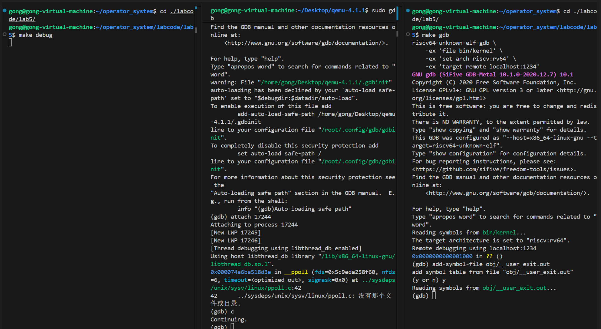

## 1 小组成员及学号

### 组长：龚子超-2312005
### 组员：熊泽宇-2312015，吴红祥-2312558

## 2 填写各个基本练习中要求完成的报告内容

### 2.1 练习一：加载应用程序并执行（需要编码）
do_execve函数调用load_icode（位于kern/process/proc.c中）来加载并解析一个处于内存中的ELF执行文件格式的应用程序。你需要补充load_icode的第6步，建立相应的用户内存空间来放置应用程序的代码段、数据段等，且要设置好proc_struct结构中的成员变量trapframe中的内容，确保在执行此进程后，能够从应用程序设定的起始执行地址开始执行。需设置正确的trapframe内容。

请在实验报告中简要说明你的设计实现过程。

请简要描述这个用户态进程被ucore选择占用CPU执行（RUNNING态）到具体执行应用程序第一条指令的整个经过。

设计实现：
```
    // 1. 设置用户栈指针
    // USTACKTOP 是用户态栈的虚拟地址顶部，在步骤(4)中已经建立了映射
    tf->gpr.sp = USTACKTOP;

    // 2. 设置程序入口点 (ELF entry)
    // 当执行 sret 指令时，CPU 会跳转到 sepc 寄存器指向的地址，即 elf->e_entry
    tf->epc = elf->e_entry;

    // 3. 设置 sstatus 寄存器
    // SSTATUS_SPP (Supervisor Previous Privilege): 
    // 设置为 0，确保 sret 返回时进入 User Mode (用户态)
    // SSTATUS_SPIE (Supervisor Previous Interrupt Enable): 
    // 设置为 1，确保进入用户态后，中断是开启的 (enabled)
    tf->status = (sstatus & ~SSTATUS_SPP) | SSTATUS_SPIE;
```

实现简述:
我们需要伪造一个中断现场，以便 CPU 通过“中断返回”的方式进入用户程序,栈指针指向已建立映射的用户栈顶,程序计数器指向 ELF 头中记录的程序入口地址,状态寄存器确保 sret 指令执行后，CPU 降级为 User Mode 且 开启中断。

简述经过：
1.schedule() 选中进程 -> proc_run() 切换页表 (SATP) -> switch_to() 切换内核上下文。
2.CPU 跳转到 forkret()，获取构造好的 trapframe，传给汇编入口 forkrets。
3.__trapret 执行 RESTORE_ALL，将 trapframe 中的值（包括 sp）填入物理寄存器。
4.执行 sret 指令。CPU 根据 sstatus 切换到用户态，并跳转到 sepc (即 elf->e_entry)，开始执行用户第一条指令。

### 2.2 练习二：父进程复制自己的内存空间给子进程（需要编码）
创建子进程的函数do_fork在执行中将拷贝当前进程（即父进程）的用户内存地址空间中的合法内容到新进程中（子进程），完成内存资源的复制。具体是通过copy_range函数（位于kern/mm/pmm.c中）实现的，请补充copy_range的实现，确保能够正确执行。

请在实验报告中简要说明你的设计实现过程。

如何设计实现Copy on Write机制？给出概要设计，鼓励给出详细设计。

#### 2.2.1 设计实现过程
copy_range 的设计目标是在进程创建（fork）过程中，将父进程用户态虚拟地址空间中指定区间 [start, end) 的有效内存页完整复制到子进程中，使子进程获得一份与父进程相互独立的地址空间副本。 

1. 按页遍历用户虚拟地址空间 

函数首先对 start 和 end 做页对齐与用户态地址合法性检查，然后以 页（PGSIZE）为基本单位，从 start 到 end 逐页遍历父进程的用户虚拟地址空间，确保内存复制的粒度与页表管理方式一致。 

2. 查找父进程页表项 

在遍历过程中，通过 get_pte(from, start, 0) 查找父进程在当前虚拟地址处的页表项： 

- 若页表项不存在，说明该地址范围内没有映射页面，直接跳过该页表对应的地址区间； 

- 若页表项存在且有效（PTE_V），则说明父进程在该虚拟地址处映射了物理页，需要进行复制。 

3. 为子进程分配页表项和物理页 

对于父进程中存在的有效页面： 

- 使用 get_pte(to, start, 1) 在子进程页表中创建或获取对应的页表项； 

- 调用 alloc_page() 为子进程分配一个新的物理页，用于存放复制后的页面内容； 

- 从父进程页表项中提取用户态访问权限，并用于子进程页面映射。 

4. 复制页面内容 
利用 page2kva 将父进程物理页和子进程新分配的物理页分别转换为内核虚拟地址，然后使用 memcpy 将父进程物理页中的全部内容（一个页面大小）复制到子进程的新物理页中，从而保证父子进程页面内容一致但物理上相互独立。 

5. 建立子进程页表映射 

在页面内容复制完成后，通过 page_insert 将子进程的新物理页映射到对应的用户虚拟地址，并设置与父进程一致的访问权限。这样，子进程在该虚拟地址处即可正确访问复制后的内存页。 
7. 相关代码 
```
int copy_range(pde_t *to, pde_t *from, uintptr_t start, uintptr_t end,
               bool share)
{
    // 确保起始和结束地址都是页对齐的
    assert(start % PGSIZE == 0 && end % PGSIZE == 0);

    // 确保复制的地址区间属于用户态地址空间
    assert(USER_ACCESS(start, end));

    // 以页为单位，从 start 遍历到 end
    do
    {
        // 根据当前虚拟地址 start，在父进程页表中查找对应的页表项
        // ptep 指向父进程的 PTE
        pte_t *ptep = get_pte(from, start, 0), *nptep;

        // 若父进程该地址对应的页表不存在
        // 说明这一整段页表都不存在，直接跳到下一个页表区间
        if (ptep == NULL)
        {
            start = ROUNDDOWN(start + PTSIZE, PTSIZE);
            continue;
        }

        // 若父进程该虚拟地址映射的页有效（存在物理页）
        if (*ptep & PTE_V)
        {
            // 在子进程页表中为该虚拟地址获取/创建对应的页表项
            if ((nptep = get_pte(to, start, 1)) == NULL)
            {
                // 子进程页表创建失败，返回内存不足错误
                return -E_NO_MEM;
            }

            // 继承父进程页表项中的用户态访问权限（U/R/W）
            uint32_t perm = (*ptep & PTE_USER);

            // 根据父进程页表项，获取对应的物理页结构体
            struct Page *page = pte2page(*ptep);

            // 为子进程分配一个新的物理页
            struct Page *npage = alloc_page();

            // 父页和新页都必须有效
            assert(page != NULL);
            assert(npage != NULL);

            // page_insert 的返回值
            int ret = 0;

            // 获取父进程物理页对应的内核虚拟地址（源地址）
            void *src_kvaddr = page2kva(page);

            // 获取子进程新物理页对应的内核虚拟地址（目标地址）
            void *dst_kvaddr = page2kva(npage);

            // 将父进程页面的全部内容复制到子进程的新页面中
            memcpy(dst_kvaddr, src_kvaddr, PGSIZE);

            // 在子进程页表中建立：
            // 虚拟地址 start -> 新物理页 npage 的映射
            // 并设置相同的用户态访问权限
            ret = page_insert(to, npage, start, perm);

            // 确保页表映射建立成功
            assert(ret == 0);
        }

        // 处理下一个虚拟页
        start += PGSIZE;

    } while (start != 0 && start < end);

    return 0;
}
```

#### 2.2.2 如何设计实现 Copy-on-Write（COW）机制？

Copy-on-Write（COW）的核心思想是在进程创建时不立即复制物理内存页面，而是在写操作发生时才进行复制，从而减少不必要的内存拷贝，提高 fork 的性能和内存利用率。 

1. fork 阶段的页面共享策略： 

在 fork 阶段，父子进程不再为每个页面分配新的物理页，而是让父子进程的页表项同时指向同一个物理页，并将这些页表项的写权限（PTE_W）清除，同时设置一个表示 COW 的标志位（如 PTE_COW）。此时，物理页的引用计数增加，表示该页被多个进程共享。 

2. 写异常触发与 COW 处理流程： 

当父进程或子进程对某个共享页面进行写操作时，由于页表项不具有写权限，会触发一次写异常（Page Fault）。在缺页异常处理函数中，操作系统检测到该页表项被标记为 COW，于是为当前进程分配一个新的物理页，将原物理页的内容复制到新页中，然后更新当前进程的页表项，使其指向新分配的物理页，并恢复写权限，同时清除 COW 标志。原物理页的引用计数相应减少。 

3. 引用计数优化与特殊情况处理： 

如果在写异常发生时发现该物理页的引用计数为 1，说明该页面并未被其他进程共享，则无需进行复制，只需直接恢复写权限即可。 

4. 总结： 

通过上述机制，COW 实现了“读时共享、写时复制”，在保证进程地址空间隔离性的同时，大幅降低了 fork 操作的时间和空间开销，是现代操作系统中 fork 实现的常用优化方法。

### 练习3：阅读分析源代码，理解进程执行 fork/exec/wait/exit 的实现，以及系统调用的实现（不需要编码）
请在实验报告中简要说明你对 fork/exec/wait/exit函数的分析。并回答如下问题：

请分析fork/exec/wait/exit的执行流程。重点关注哪些操作是在用户态完成，哪些是在内核态完成？内核态与用户态程序是如何交错执行的？内核态执行结果是如何返回给用户程序的？
请给出ucore中一个用户态进程的执行状态生命周期图（包执行状态，执行状态之间的变换关系，以及产生变换的事件或函数调用）。（字符方式画即可）
执行：make grade。如果所显示的应用程序检测都输出ok，则基本正确。（使用的是qemu-4.1.1）

#### fork()函数
用户态执行过程

- 用户程序调用 `fork()`  
- 通过 `ecall` 指令触发系统调用  
- CPU 自动保存用户态上下文（寄存器、PC 等），切换到内核态  

在用户态中，fork 仅负责**发起创建子进程的请求**。


内核态执行过程（do_fork）

内核态函数 `do_fork` 完成创建子进程的全部核心工作，主要包括：

1. **分配进程控制块**
   - 调用 `alloc_proc()` 分配并初始化 `proc_struct`

2. **分配内核栈**
   - 调用 `setup_kstack(proc)` 为子进程分配独立内核栈

3. **复制或共享内存空间**
   - 调用 `copy_mm(clone_flags, proc)`  
   - 根据 clone_flags 决定复制或共享父进程的 mm 结构

4. **复制线程上下文**
   - 调用 `copy_thread(proc, stack, tf)`  
   - 复制 trapframe，使子进程看起来像刚从 fork 返回

5. **建立进程关系并加入管理结构**
   - 分配 PID（`get_pid()`）  
   - 插入哈希表（`hash_proc()`）  
   - 建立父子关系（`set_links()`）

6. **唤醒子进程**
   - 调用 `wakeup_proc(proc)`  
   - 将子进程状态设置为 `PROC_RUNNABLE`


fork 返回用户态

fork 系统调用具有“返回两次”的特点：

- 在父进程中返回子进程的 PID  
- 在子进程中返回 0  

该机制通过**复制 trapframe 并修改返回寄存器的值**实现。

#### exec()函数

用户态执行过程

- 用户程序调用 `execve()`  
- 程序名和二进制数据仍位于用户地址空间  


内核态执行过程（do_execve）

`do_execve` 在内核态中完成程序替换操作，主要步骤如下：

1. **检查用户内存合法性**
   - 调用 `user_mem_check()` 验证参数指针有效性  

2. **释放原用户地址空间**
   - `exit_mmap()`  
   - `put_pgdir()`  
   - `mm_destroy()`

3. **加载新程序**
   - 调用 `load_icode(binary, size)`  
   - 创建新的页表与地址空间  
   - 加载程序代码和数据，初始化用户栈  

4. **设置进程名**
   - 调用 `set_proc_name()`  


exec 执行结果

- 执行成功：当前进程从新程序入口地址开始执行  
- 执行失败：调用 `do_exit()` 终止当前进程  

exec 不创建新进程，仅替换当前进程的程序内容，PID 与 `proc_struct` 均保持不变。


#### wait()函数

用户态执行过程
- 父进程调用 wait() 或 waitpid()
- 通过系统调用进入内核态

内核态执行过程（do_wait）

`do_wait` 的主要执行步骤如下：

1. 查找子进程

    - 若指定了 pid，则查找对应的子进程
    - 否则遍历当前进程的所有子进程

2. 处理僵尸子进程

    - 读取子进程的 exit_code
    - 将子进程从进程哈希表和进程链表中移除
    - 释放子进程的内核栈和 proc_struct 等内核资源

3. 子进程尚未退出的情况

    - 将父进程状态设置为 PROC_SLEEPING
    - 设置等待原因：

        `current->wait_state = WT_CHILD;`

    - 调用 schedule() 主动让出 CPU，等待子进程退出

`wait/waitpid` 是唯一真正释放子进程内核资源的系统调用，用于完成子进程的最终回收。


#### exit()函数
用户态执行过程
- 用户程序调用 exit()
- 通过系统调用指令陷入内核态，进入内核的退出处理流程

内核态执行过程（do_exit）

`do_exit` 函数的主要工作包括以下几个方面：
1. 释放用户态内存资源
    - exit_mmap();
    - put_pgdir();
    - mm_destroy();
    - 解除进程虚拟地址空间与物理内存的映射,释放页表及相关内存管理结构
2. 设置进程状态
    - current->state = PROC_ZOMBIE;
    - current->exit_code = error_code;
    - 将进程状态设置为僵尸态（PROC_ZOMBIE）
    - 保存进程退出码，供父进程回收时读取
3. 唤醒父进程
    - 若父进程正在执行 wait/waitpid 并处于睡眠状态
    - 调用 wakeup_proc(parent) 唤醒父进程
4. 处理孤儿进程
    - 若当前进程仍有子进程存在
    - 将这些子进程重新挂接到 initproc（1 号进程）下
5. 调度其他进程
    - 调用 schedule() 进行进程调度
    - 当前进程不再被调度执行

调用 exit 后，进程并不会立即消失，而是进入僵尸态，等待父进程通过 wait 回收。


uCore 中用户态进程在其生命周期内，会经历若干不同的执行状态。  
这些状态由内核通过进程控制块（
`proc_struct`）中的 `state`
 字段进行管理，并在不同的系统调用或调度事件触发下发生转换。


#### 进程状态说明与状态转换分析

```
                    fork()
        +--------------------------------+
        |                                |
        v                                |
   +-----------+      exec()        +-----------+
   |  NEW      | -----------------> | RUNNING   |
   +-----------+                    +-----------+
                                          |
                                          | 时间片用完 / wait
                                          v
                                   +--------------+
                                   |  SLEEPING    |
                                   | (WT_CHILD)   |
                                   +--------------+
                                          |
                                          | wakeup_proc()
                                          v
                                   +--------------+
                                   |  RUNNABLE    |
                                   +--------------+
                                          |
                                          | schedule()
                                          v
                                   +--------------+
                                   |  RUNNING     |
                                   +--------------+
                                          |
                                          | exit()
                                          v
                                   +--------------+
                                   |  ZOMBIE      |
                                   +--------------+
                                          |
                                          | do_wait()
                                          v
                                   +--------------+
                                   |  DEAD        |
                                   +--------------+
```

##### 1. PROC
_UNINIT（未初始化）

**状态说明：**

- 进程刚通过 `alloc_proc()` 创建
- 仅完成 `proc_struct`
 的基本字段初始化
-
 尚未加入调度队列，不能被调度执行

**转换事件：**

- `proc_init()` → `PROC_RUNNABLE`  
  初始化内核或用户进程后，将进程置为可运行状态

- `wakeup_proc()` → `PROC_RUNNABLE`  
  进程完成必要初始化后被唤醒，进入可运行状态


##### 2. PROC
_RUNNABLE（可运行）

**状态说明：**

- 进程处于可被调度的状态
- 可能正在运行，也可能位于就绪队列中等待 CPU
- 这是 uCore 中最常见的进程状态

**转换事件：**

- `proc_init()` 或 `wakeup
_proc()` → `PROC_
RUNNABLE`  
  进程从其他状态被唤醒或初始化完成

- `schedule()` → `PROC_RUNNABLE`  
  进程时间片用完或被抢占，重新加入就绪队列

- `proc_run()` → **[RUNNING]**  
  被调度器选中，开始在 CPU 上运行

- `do_wait()` → `PROC_SLEEPING`  
  进程等待子进程退出而主动睡眠

- `do_exit()` → `PROC_ZOMBIE`  
  进程主动退出，进入僵尸状态


##### 3. [RUNNING]（正在运行）

**状态说明：**

-
 进程正在 CPU 上执行
-
 在 uCore 实现中，[RUNNING] 并不是独立状态
- 它是 `PROC_RUNNABLE`
 的一个运行子状态

**转换事件：**

- `proc_run()` → **[RUNNING]**  
  调度器选中该进程，加载其上下文并开始执行

- `schedule()` → `PROC_RUNNABLE`  
  时间片用完或发生抢占，进程让出 CPU


##### 4. PROC
_SLEEPING（睡眠）

**状态说明：**

- 进程因等待某些事件而被阻塞
- 不会被调度执行，直到等待条件满足
- 常见于同步或资源等待场景

**转换事件：**

- `do_wait()` → `PROC
_SLEEPING`  
  等待子进程退出

- `try_
free_pages()` → `PROC_
SLEEPING`  
  等待内存页释放（内存资源不足）

- `wakeup_proc()` → `PROC_RUNNABLE`  
  等待事件发生（如子进程退出、资源可用），进程被唤醒


##### 5. PROC
_ZOMBIE（僵尸）

**状态说明：**

- 进程已经执行完毕并退出
- 用户态内存资源已释放
- 仍保留 `proc_struct`，等待父进程回收

**转换事件：**

- `do_exit()` → `PROC_ZOMBIE`  
  进程调用 exit 退出，进入僵尸状态

- `do_wait()` → **[进程销毁]**  
  父进程回收其资源，释放内核栈与进程控制块

#### 执行make grade
```
badsegment:              (1.1s)
  -check result:                             OK
  -check output:                             OK
divzero:                 (1.0s)
  -check result:                             OK
  -check output:                             OK
softint:                 (1.0s)
  -check result:                             OK
  -check output:                             OK
faultread:               (11.3s)
  -check result:                             OK
  -check output:                             OK
faultreadkernel:         (11.3s)
  -check result:                             OK
  -check output:                             OK
hello:                   (1.0s)
  -check result:                             OK
  -check output:                             OK
testbss:                 (11.3s)
  -check result:                             OK
  -check output:                             OK
pgdir:                   (1.0s)
  -check result:                             OK
  -check output:                             OK
yield:                   (1.0s)
  -check result:                             OK
  -check output:                             OK
badarg:                  (1.0s)
  -check result:                             OK
  -check output:                             OK
exit:                    (1.0s)
  -check result:                             OK
  -check output:                             OK
spin:                    (1.0s)
  -check result:                             OK
  -check output:                             OK
forktest:                (1.0s)
  -check result:                             OK
  -check output:                             OK
Total Score: 130/130
```

## 3 分支任务

### 3.1 LAB2分支任务：gdb 调试页表查询过程

打开三个终端
```
xiongxiongxiong@xiongxiongxiong-VMware-Virtual-Platform:~/os/labcode/lab2$ make debug
+ cc kern/init/entry.S
+ cc kern/init/init.c
+ cc kern/libs/stdio.c
+ cc kern/debug/panic.c
+ cc kern/driver/console.c
+ cc kern/driver/dtb.c
+ cc kern/mm/best_fit_pmm.c
+ cc kern/mm/buddy_pmm.c
+ cc kern/mm/default_pmm.c
+ cc kern/mm/pmm.c
+ cc libs/printfmt.c
+ cc libs/readline.c
+ cc libs/sbi.c
+ cc libs/string.c
+ ld bin/kernel
riscv64-unknown-elf-objcopy bin/kernel --strip-all -O binary bin/ucore.img
```
```
xiongxiongxiong@xiongxiongxiong-VMware-Virtual-Platform:~/os/labcode/lab2$ pgrep -f qemu-system-riscv64
45399
xiongxiongxiong@xiongxiongxiong-VMware-Virtual-Platform:~/os/labcode/lab2$ sudo gdb
[sudo] password for xiongxiongxiong: 
GNU gdb (Ubuntu 16.2-8ubuntu1) 16.2
Copyright (C) 2024 Free Software Foundation, Inc.
License GPLv3+: GNU GPL version 3 or later <http://gnu.org/licenses/gpl.html>
This is free software: you are free to change and redistribute it.
There is NO WARRANTY, to the extent permitted by law.
Type "show copying" and "show warranty" for details.
This GDB was configured as "x86_64-linux-gnu".
Type "show configuration" for configuration details.
For bug reporting instructions, please see:
<https://www.gnu.org/software/gdb/bugs/>.
Find the GDB manual and other documentation resources online at:
    <http://www.gnu.org/software/gdb/documentation/>.

For help, type "help".
Type "apropos word" to search for commands related to "word".
(gdb) attach 45399
Attaching to process 45399
[New LWP 45401]
[New LWP 45400]
[Thread debugging using libthread_db enabled]
Using host libthread_db library "/lib/x86_64-linux-gnu/libthread_db.so.1".
__syscall_cancel_arch ()
    at ../sysdeps/unix/sysv/linux/x86_64/syscall_cancel.S:56
warning: 56     ../sysdeps/unix/sysv/linux/x86_64/syscall_cancel.S: No such file or directory
(gdb) handle SIGPIPE nostop noprint
Signal        Stop      Print   Pass to program Description
SIGPIPE       No        No      Yes             Broken pipe
```
```
xiongxiongxiong@xiongxiongxiong-VMware-Virtual-Platform:~/os/labcode/lab2$ make gdb
riscv64-unknown-elf-gdb \
    -ex 'file bin/kernel' \
    -ex 'set arch riscv:rv64' \
    -ex 'target remote localhost:1234'
GNU gdb (SiFive GDB-Metal 10.1.0-2020.12.7) 10.1
Copyright (C) 2020 Free Software Foundation, Inc.
License GPLv3+: GNU GPL version 3 or later <http://gnu.org/licenses/gpl.html>
This is free software: you are free to change and redistribute it.
There is NO WARRANTY, to the extent permitted by law.
Type "show copying" and "show warranty" for details.
This GDB was configured as "--host=x86_64-linux-gnu --target=riscv64-unknown-elf".
Type "show configuration" for configuration details.
For bug reporting instructions, please see:
<https://github.com/sifive/freedom-tools/issues>.
Find the GDB manual and other documentation resources online at:
    <http://www.gnu.org/software/gdb/documentation/>.

For help, type "help".
Type "apropos word" to search for commands related to "word".
Reading symbols from bin/kernel...
The target architecture is set to "riscv:rv64".
Remote debugging using localhost:1234
0x0000000000001000 in ?? ()
```

设置断点
```
(gdb) b kern_init
Breakpoint 1 at 0xffffffffc02000d8: file kern/init/init.c, line 30.
```
运行并查看
```
(gdb) c          
Continuing.

Breakpoint 1, kern_init () at kern/init/init.c:30
30          memset(edata, 0, end - edata);
(gdb) x/9i $pc
=> 0xffffffffc02000d8 <kern_init>:      auipc   a0,0x5
   0xffffffffc02000dc <kern_init+4>:    addi    a0,a0,-192
   0xffffffffc02000e0 <kern_init+8>:    auipc   a2,0x5
   0xffffffffc02000e4 <kern_init+12>:   addi    a2,a2,280
   0xffffffffc02000e8 <kern_init+16>:   addi    sp,sp,-16
   0xffffffffc02000ea <kern_init+18>:   sub     a2,a2,a0
   0xffffffffc02000ec <kern_init+20>:   li      a1,0
   0xffffffffc02000ee <kern_init+22>:   sd      ra,8(sp)
   0xffffffffc02000f0 <kern_init+24>:
    jal ra,0xffffffffc02012ce <memset>
```
单步执行到需要的步数之前
```
(gdb) si
0xffffffffc02000dc      30          memset(edata, 0, end - edata);
(gdb) 
0xffffffffc02000e0      30          memset(edata, 0, end - edata);
(gdb) 
0xffffffffc02000e4      30          memset(edata, 0, end - edata);
(gdb) 
0xffffffffc02000e8      28      int kern_init(void) {
(gdb) 
0xffffffffc02000ea      30          memset(edata, 0, end - edata);
(gdb) 
0xffffffffc02000ec      30          memset(edata, 0, end - edata);
(gdb) 
0xffffffffc02000ee      28      int kern_init(void) {
```

去qemu源码处设置断点
```
(gdb) b get_physical_address
Breakpoint 1 at 0x568747c7cfd7: file /home/xiongxiongxiong/qemu-4.1.1/target/riscv/cpu_helper.c, line 158.
(gdb) c
Continuing.
```
继续单步执行
```
(gdb) si
0xffffffffc02000f0      30          memset(edata, 0, end - edata);
```
执行完最后的步骤并查看地址
```
(gdb) c
Continuing.

Thread 1 "qemu-system-ris" hit Breakpoint 1, get_physical_address (env=0x56876a9e00c0, physical=0x7fff2fe9c128, 
    prot=0x7fff2fe9c120, addr=18446744072637907160, 
    access_type=0, mmu_idx=1)
    at /home/xiongxiongxiong/qemu-4.1.1/target/riscv/cpu_helper.c:158
158     {
(gdb) p/x addr
$1 = 0xffffffffc02000d8
```
查看栈地址
```
(gdb) i r sp
sp             0xffffffffc0203ff0       0xffffffffc0203ff0
```

### 3.2 LAB5分支任务：gdb 调试系统调用以及返回
本次实验一共要用三个终端：
- 终端一：启动qemu,使用make debug命令。
- 终端二：附加qemu进程，调试内核 
使用指令pgrep -f qemu-system-riscv64 获取QEMU进程的PID，随后启动GDB（sudo gdb）， 然后用attach <刚才查到的PID>将其附加在QEMU进程上。 
- 终端三：启动gdb，连接qemu，调试ucore内核 

要正确加载用户程序的调试信息，需要在终端三中使用以下命令：
```
(gdb) add-symbol-file obj/__user_exit.out
add symbol table from file "obj/__user_exit.out"
(y or n) y
Reading symbols from obj/__user_exit.out...
(gdb) 
```
开始跟踪指令的执行流程 
在终端三中设置断点，执行到用户态的syscall函数：
```
(gdb)  break user/libs/syscall.c:18
Breakpoint 1 at 0x8000f8: file user/libs/syscall.c, line 19.
(gdb) 
 ```
 继续执行，直到ucore执行到ecall指令之前：
 ```
(gdb) c
Continuing.

Breakpoint 1, syscall (num=2)
    at user/libs/syscall.c:19
19          asm volatile (
(gdb) x/8i $pc
=> 0x8000f8 <syscall+32>:       ld      a0,8(sp)
   0x8000fa <syscall+34>:       ld      a1,40(sp)
   0x8000fc <syscall+36>:       ld      a2,48(sp)
   0x8000fe <syscall+38>:       ld      a3,56(sp)
   0x800100 <syscall+40>:       ld      a4,64(sp)
   0x800102 <syscall+42>:       ld      a5,72(sp)
   0x800104 <syscall+44>:       ecall
   0x800108 <syscall+48>:       sd      a0,28(sp)
(gdb) si
0x00000000008000fa      19          asm volatile (
(gdb) si
0x00000000008000fc      19          asm volatile (
(gdb) si
0x00000000008000fe      19          asm volatile (
(gdb) si
0x0000000000800100      19          asm volatile (
(gdb) si
0x0000000000800102      19          asm volatile (
(gdb) si
0x0000000000800104      19          asm volatile (
(gdb) i r $pc
pc             0x800104 0x800104 <syscall+44>
(gdb) 
```
可以知道当前执行到ecall指令处，查看寄存器a0-a5的值：
```
(gdb) info registers a0 a1 a2 a3 a4 a5
a0             0x2      2
a1             0x0      0
a2             0x0      0
a3             0x0      0
a4             0x0      0
a5             0x0      0
```
可以看到a0寄存器中存放的值为2，表示当前执行的是sys_exit系统调用。
继续单步执行，进入内核态：
```
(gdb) si
0xffffffffc0200e78 in __alltraps ()
    at kern/trap/trapentry.S:123
123         SAVE_ALL
(gdb) 
```
查看当前 PC 附近的汇编代码:
```
(gdb) x/20i $pc
=> 0xffffffffc0200e78 <__alltraps+4>:
    bnez        sp,0xffffffffc0200e80 <__alltraps+12>
   0xffffffffc0200e7c <__alltraps+8>:
    csrr        sp,sscratch
   0xffffffffc0200e80 <__alltraps+12>:
    addi        sp,sp,-288
   0xffffffffc0200e82 <__alltraps+14>:
    sd  zero,0(sp)
   0xffffffffc0200e84 <__alltraps+16>:
    sd  ra,8(sp)
   0xffffffffc0200e86 <__alltraps+18>:
    sd  gp,24(sp)
   0xffffffffc0200e88 <__alltraps+20>:
    sd  tp,32(sp)
   0xffffffffc0200e8a <__alltraps+22>:
    sd  t0,40(sp)
   0xffffffffc0200e8c <__alltraps+24>:
    sd  t1,48(sp)
   0xffffffffc0200e8e <__alltraps+26>:
    sd  t2,56(sp)
   0xffffffffc0200e90 <__alltraps+28>:
    sd  s0,64(sp)
   0xffffffffc0200e92 <__alltraps+30>:
    sd  s1,72(sp)
   0xffffffffc0200e94 <__alltraps+32>:
    sd  a0,80(sp)
   0xffffffffc0200e96 <__alltraps+34>:
    sd  a1,88(sp)
   0xffffffffc0200e98 <__alltraps+36>:
    sd  a2,96(sp)
   0xffffffffc0200e9a <__alltraps+38>:
    sd  a3,104(sp)
   0xffffffffc0200e9c <__alltraps+40>:
    sd  a4,112(sp)
   0xffffffffc0200e9e <__alltraps+42>:
    sd  a5,120(sp)
   0xffffffffc0200ea0 <__alltraps+44>:
    sd  a6,128(sp)
   0xffffffffc0200ea2 <__alltraps+46>:
    sd  a7,136(sp)
(gdb) 
```
bnez sp, 0xffffffffc0200e80 <__alltraps+12>
csrr sp, sscratch,两行指令用于判断当前 sp 是否有效，如果无效则从 sscratch 寄存器中恢复 sp 的值。
addi sp, sp, -288，在内核栈上分配 trapframe 空间
后续指令用于寄存器保存 = trapframe 构造
在trap函数中设置断点，观察trapframe结构：
```
(gdb) b trap
Breakpoint 2 at 0xffffffffc0200dea: file kern/trap/trap.c, line 262.
(gdb) c
Continuing.

Breakpoint 2, trap (tf=0xffffffffc04b0ee0)
    at kern/trap/trap.c:262
262         if (current == NULL)
(gdb) p *tf
$1 = {gpr = {zero = 0, ra = 8390000, 
    sp = 2147483456, gp = 0, tp = 0, t0 = 0, t1 = 0, 
    t2 = 0, s0 = 0, s1 = 32, a0 = 2, a1 = 0, a2 = 0, 
    a3 = 0, a4 = 0, a5 = 0, a6 = 0, a7 = 0, s2 = 0, 
    s3 = 0, s4 = 0, s5 = 0, s6 = 0, s7 = 0, s8 = 0, 
    s9 = 0, s10 = 0, s11 = 0, t3 = 0, t4 = 0, 
    t5 = 0, t6 = 0}, status = 9223372036855062560, 
  epc = 8388868, tval = 0, cause = 8}
(gdb) 
```
可以看到cause为8，说明此时发生的是用户态的系统调用。
对syscall函数下断点：
```
(gdb) b syscall
Breakpoint 3 at 0x8000d8: syscall. (2 locations)
(gdb) c
Continuing.

Breakpoint 3, syscall () at kern/syscall/syscall.c:83
83          struct trapframe *tf = current->tf;
(gdb) 
```
查看 current 与 tf:
```
(gdb)  p current
$2 = (struct proc_struct *) 0xffffffffc04ab250
(gdb)  p *current
$3 = {state = PROC_RUNNABLE, pid = 2, runs = 1, 
  kstack = 18446744072640720896, need_resched = 0, 
  parent = 0xffffffffc04ab130, 
  mm = 0xffffffffc04ab370, context = {
    ra = 18446744072637922896, 
    sp = 18446744072640728800, s0 = 0, s1 = 0, 
    s2 = 0, s3 = 0, s4 = 0, s5 = 0, s6 = 0, s7 = 0, 
    s8 = 0, s9 = 0, s10 = 0, s11 = 0}, 
  tf = 0xffffffffc04b0ee0, pgdir = 2152402944, 
  flags = 0, 
  name = "forktest\000\000\000\000\000\000\000", 
  list_link = {
    prev = 0xffffffffc02aa758 <proc_list>, 
    next = 0xffffffffc04ab1f8}, hash_link = {
    prev = 0xffffffffc02a7668 <hash_list+3856>, 
    next = 0xffffffffc02a7668 <hash_list+3856>}, 
  exit_code = 0, wait_state = 0, cptr = 0x0, 
  yptr = 0x0, optr = 0x0}
(gdb) p tf
$4 = <optimized out>
(gdb) p tf->gpr.a0
value has been optimized out
(gdb) p current->tf->gpr.a0
$5 = 2
(gdb) 
```
这一步证明：syscall 处理函数使用的 trapframe 正是刚才在 __alltraps 中构造的那个。
随后在sys_exit(内核)处设置断点，进入sys_exit函数:
```
(gdb) b sys_exit
Breakpoint 4 at 0x800110: sys_exit. (2 locations)
(gdb) c
Continuing.
Breakpoint 4, sys_exit (arg=0xffffffffc04b8e88) at kern/syscall/syscall.c:12
12           return do_exit(error_code);
```
在sret前打断点： 
```
(gdb) break kern/trap/trapentry.S:133
Breakpoint 5 at 0xffffffffc0200f3a: file kern/trap/trapentry.S, line 133.
(gdb) c
Continuing.

Breakpoint 5, __trapret () at kern/trap/trapentry.S:133
133         sret
(gdb) info registers pc
pc             0xffffffffc0200f3a       0xffffffffc0200f3a <__trapret+86>  #说明 CPU 尚未返回用户态。
(gdb) info registers sepc sstatus scause
sepc           0xffffffffc0203dd6       -1071628842   #内核地址
sstatus        0x8000000000046120       -9223372036854488800  #返回目标仍为 S 模式
scause         0x0      0  #异常处理的返回阶段
(gdb) 
```
 执行sret返回用户态： 
```
Breakpoint 6, 0x0000000000800108 in ?? ()
(gdb) x/7i $pc
=> 0x800108:    sd      a0,28(sp)
   0x80010c:    lw      a0,28(sp)
   0x80010e:    addi    sp,sp,144
   0x800110:    ret
   0x800112:    mv      a1,a0
   0x800114:    li      a0,1
   0x800116:    j       0x8000d8
(gdb) info register pc a0
pc             0x800108 0x800108 #正好落在 ecall 的下一条指令
a0             0x0      0  #内核态 do_fork 的返回值,经 trapframe 保存 → 恢复,经 sret 带回用户态
(gdb) 
```
问题：
1. 指令翻译机制理解：

TCG 的核心思想：
将 Guest 指令翻译为 Host 可执行的中间代码，再执行。
2. 内核态无法给用户地址打断点
```
break *0x800108
Cannot access memory
```


